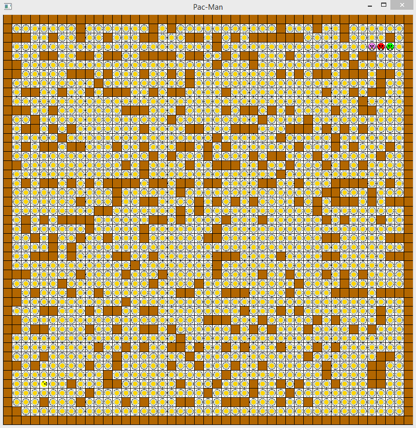

# Pac-Man

Artificial intelligence - Pac-man

Algorithm description:
Monsters:
Each monster calculates a trajectory towards Pacman using A-star when
G function - the number of squares from the beginning (the beginning is the position of the monster)
H function - Manhattan distance between the monster and Pacman
- Function F = G + H

Pacman:
To locate the Pacman monster, runs BFS.
A stop condition for BFS is when a monster has been found (since it found first is also the closest) or the priority queue holding gray cells is empty.
After locating the monster, run the find_safe_target () method.
Which aims to find a safe destination for the Pacman
The route to this destination is calculated by A-star when
- H function - Manhattan distance between the safe location and the Pacman less the highest amount of currency value
G function - the distance of the cells from the source (from the Pacman)
- Function F = H + G

The find_safe_target () method -
Calculates the row and column of the safest cell for the Pacman as follows:
If the distance (Manhattan) between the monster and Pacman is greater than MSZ, then necessarily the monster is not in the same quarter of Pacman in the maze, in which case the target of Pacman will try to keep the distance of the monsters by staying in the same area until one of the monsters approaches him.
When the monster is approaching, and the distance to Pacman is less than MSZ, then the target will be determined in the quarter adjacent to Pacman.
The Pacman avoids walking diagonally as this is usually the path the monsters will choose to reach the Pacman.

When route search algorithms are enabled:
Monsters:
Because the monsters start from a nearby area in the maze, their algorithm activation is done when
• The monster has reached its destination set in A-star without catching the Pacman
• The number of steps unique to it which range from MSZ to 2 × MSZ (if the value were not unique to the same monster within a few steps, the monsters would coalesce to the same trajectory and lose the numerical advantage over the Pacman)
- This range was chosen to be between MSZ and 2× MSZ as it is a top barrier for a concise route between 2 points in the maze (diagonal edges)
Pacman:
• Each time, the Pacman reached the target set in the last A-star run.
• Whenever the monster's distance is smaller than the last recorded and also smaller than MSZ / 5.

